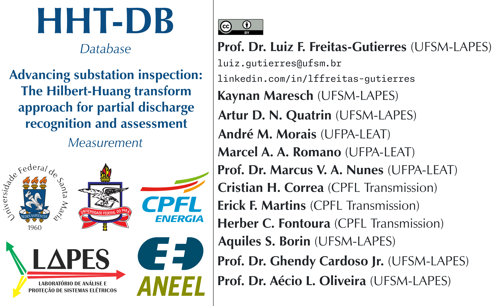

# HHT-DB

**HHT-DB** is a database comprising photos, sound recordings, ultrasonic signals converted via heterodyning, and reports generated by the [Sonotec-Sonaphone III](https://www.sonotec.eu/en/products/preventive-maintenance/ultrasonic-testing-devices/sonaphone/) from inspections conducted at a 69/138/230 kV substation in Brazil. This database is associated with the scientific article titled "Advancing substation inspection: The Hilbert-Huang transform approach for partial discharge recognition and assessment," submitted for peer review to the journal [Measurement](https://www.sciencedirect.com/journal/measurement).

**HHT-DB** includes six field-assessed case studies:
- IS-PhaseA: Insulator string (Phase A).
- IS-PhaseB: Insulator string (Phase B).
- IS-PhaseC: Insulator string (Phase C).
- BN: Background noise, distant from any equipment.
- AS: Ambient sounds in the substation area.
- XFMR: Transformer with the cooling system turned off.

Each case study may contain $n$ sets of records. For instance, measurements for the insulator string, phase A (IS-PhaseA), include three subfolders labeled 01, 02, and 03.

Each subfolder organizes inspection data and records into the following directories:
- Photos: Photographic records of the inspection.
- Report: Automatically generated reports from the [Sonotec-Sonaphone III](https://www.sonotec.eu/en/products/preventive-maintenance/ultrasonic-testing-devices/sonaphone/) ([DataSuite](https://www.sonotec.eu/en/products/preventive-maintenance/software/datasuite/)).
- SoundRecordings: Audio recordings captured alongside each ultrasonic signature.
- ThermographicImages: Thermographic images acquired using the [Fluke Ti25](https://www.fluke.com/en-us/product/thermal-cameras/ti25).
- UltrasonicSignatures: Ultrasonic signatures recorded with the [Sonotec-Sonaphone III](https://www.sonotec.eu/en/products/preventive-maintenance/ultrasonic-testing-devices/sonaphone/) coupled with the [Sonotec-BS30](https://www.sonotec.eu/en/products/preventive-maintenance/ultrasonic-testing-devices/sonaphone/sensoren/bs30/) parabolic sensor.

The figure below illustrates the database structure, highlighting the files contained in subfolder 01 of the case study for the insulator string, phase A (IS-PhaseA).

**HHT-DB** also [provides](https://github.com/LFFreitas-Gutierres/HHT-DB/tree/main/TestObjectDesigns) the designs of the test devices used in the Finite Element Method Magnetics (FEMM, version 4.2) simulations presented in the article, including a tip-flat system and an insulator string.

---

*Corresponding author:* [Prof. Dr. Luiz F. Freitas-Gutierres](https://www.linkedin.com/in/lffreitas-gutierres/) ([luiz.gutierres@ufsm.br](mailto:luiz.gutierres@ufsm.br)).

### Acknowledgments

The authors would like to acknowledge the [R&D Program](https://www.gov.br/aneel/pt-br/assuntos/programa-de-pesquisa-desenvolvimento-e-inovacao) of the Brazilian Electricity Regulatory Agency (Agência Nacional de Energia Elétrica [ANEEL](https://www.gov.br/aneel/pt-br)) for facilitating this research endeavor. The investigations discussed in this paper are associated with the project PD-05785-2107/2021-DE2107: "Methodology for aging assessment of insulation in instrument transformers and surge arresters through ultrasonic measurements of partial discharges", conducted in collaboration between [CPFL Transmission](https://www2.grupocpfl.com.br/unidades-de-negocios/cpfl-transmissao) and the [Federal University of Santa Maria (UFSM)](https://www.ufsm.br/).

